# Data Cleaning Project - Coffee Sale Dataset

## 1. **Project Overview**

This project emphasizes practicing data cleaning with Google Sheets. It involved using advanced functions, sorting, and filtering techniques to detect errors, inconsistencies, and missing values. The cleaning process resulted in a final dataset with no errors or missing values, utilizing imputation, calculation methods, or marking entries as 'NA' for further review.

## 2. **Data Overview**

**Dataset Source:** [Kaggle - Cafe Sales Dirty Data for Cleaning](https://www.kaggle.com/datasets/ahmedmohamed2003/cafe-sales-dirty-data-for-cleaning-training/data)  
**File Name:** `dirty_cafe_sales.csv`  
**Rows:** 10,000 records  
**Columns:** 8 key attributes including Transaction ID, Item, Quantity, Price per Unit, Total Spent, Payment Method, Location, and Transaction Date.

**Columns Overview:**

* **Transaction ID**: Unique identifier for each transaction.
* **Item**: The type of coffee or related product sold.
* **Quantity**: Number of units sold in a transaction.
* **Price per Unit**: Unit price of the item sold.
* **Total Spent**: Total amount spent in the transaction.
* **Payment Method**: Method used to pay (e.g., Credit Card, Cash, Digital Wallet).
* **Location**: In-store or takeaway.
* **Transaction Date**: The date the transaction occurred.

The first five rows of the raw dataset:
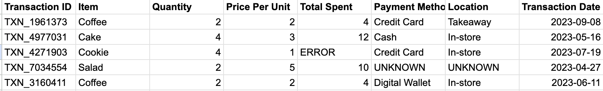

---

## 3. Data initial check

Before starting the cleaning process, I always make a copy of the original dataset. This helps reduce the risk of errors and allows me to easily revert back if any issues arise during the cleaning process.

Next, I identify the main issues in the dataset and break them down into manageable tasks.

### **Duplicates Check**

**Task:** Identify and handle duplicate rows if found.  

**Approach:**
* Select any data point in the dataset.
* Press `Cmd + A` to select all rows.
* Navigate to the Data tool, then go to the "Data Clean-Up" section.
* Choose "Remove Duplicates."

  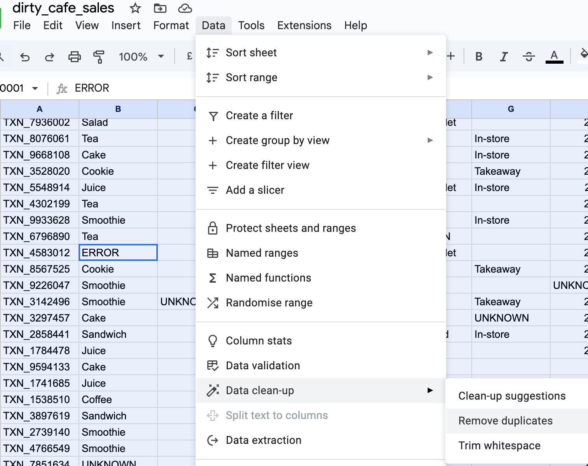

**Result:** No duplicate rows were found in the dataset. To confirm, I copied the transaction-ID column and checked for duplicates. The result showed zero duplicates, verifying that the column is clean and requires no further fixes.

### **Data Validation**  

**Task:** Ensure the consistency of data points

**Approach:**  

* Use **filter** and **sort** to identify invalid data points. This approach works well for columns with fewer than 10 unique values. For columns with thousands of unique values, such as identifiers, alternative techniques must be used to detect invalid entries.

* The **transaction_id** column serves as the identifier, with each record containing a unique value. To validate the data points, I first use the `LEN()` function to verify that all entries have a consistent length.
* Next, I use the `LEFT()` function to extract the first four characters and ensure they all start with **TXN_**.
* Finally, I filter the column to check for consistency in both length and prefix.

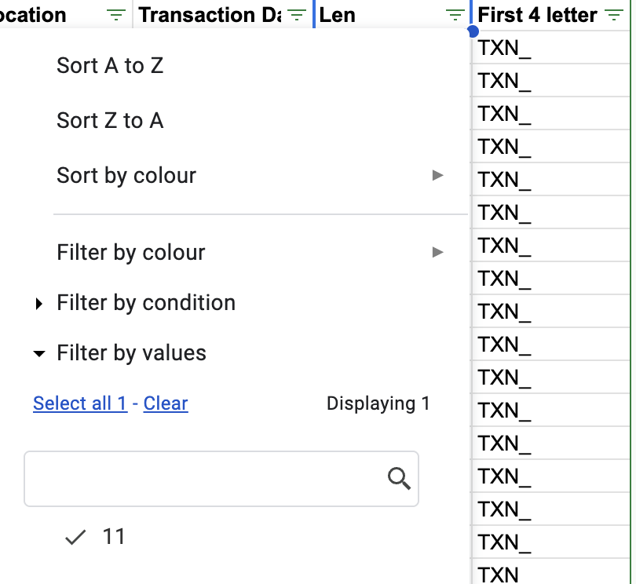

**Results:**  

 * The **transaction_id** column is consistent, with a length of 11 characters and all entries starting with **TXN_**. No further changes are required.
  * Other columns have issues like blank cells, **ERROR**, and **UNKNOWN** values, which will be addressed in manageable steps.

## 5. **Data Cleaning Process**

In real-world scenarios, if the transaction_id is valid, we can investigate further within the system to identify the source of the problem (e.g., human error, system glitches, etc.) and potentially retrieve the correct data points.

For this data cleaning practice exercise, errors, unknowns, and missing values will be addressed using appropriate techniques, such as calculation, imputation, or removal if necessary.

### **5.1. Handling Missing and Invalid Records in the `price_per_unit` Column**

**Assumption:** The price for each item is unchanged over time, meaning each item has a fixed price that does not fluctuate. This assumption was made based on the context of the data and the scenario provided, where product prices are generally stable.  

* **Task:** Extract the unit price for each item, then use it to fill in the missing and error values.  
* **Approach:** 

VLOOKUP: After obtaining the valid item list by copying the item column and removing duplicates to different sheet, I used `VLOOKUP` to retrieve the corresponding unit prices.

I copied the valid item and price columns to a different sheet to ensure the lookup only references valid values. The `FALSE` argument in `VLOOKUP` was used to enforce an exact match and prevent incorrect results.

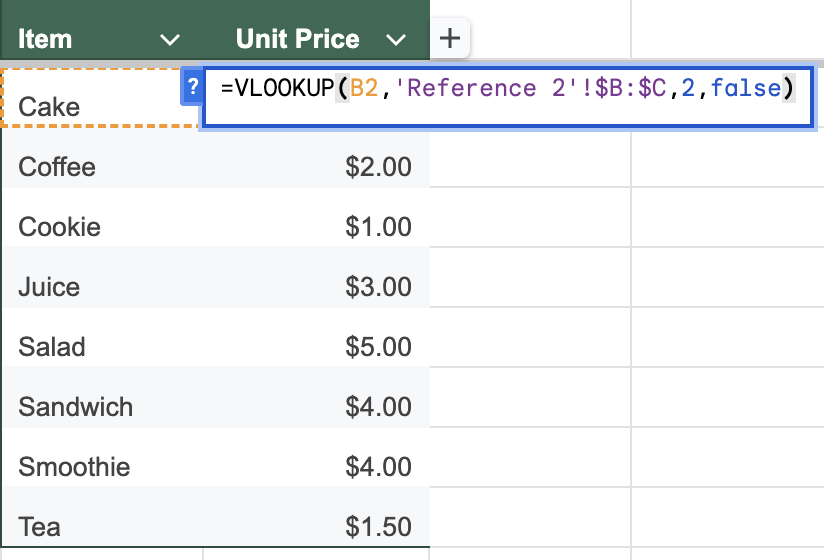

For valid items that have missing or incorrect unit prices, I used `VLOOKUP` to reference the unit price table and fill in the missing values.

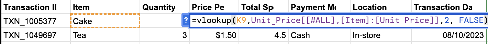

For invalid items, the **total spent** and **quantity** values are available, as shown below:

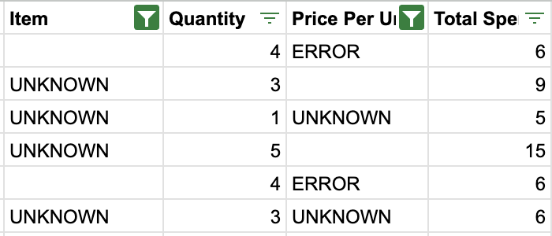

XLOOKUP: 
I calculated the item price by dividing total spent by quantity. Then, I used `XLOOKUP` to fill in the corresponding item name. `XLOOKUP` allows specifying both the lookup column and the return column, making it flexible for this task as the search key if the price , which is not the first column for using vlookup.

  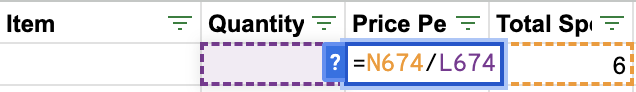
  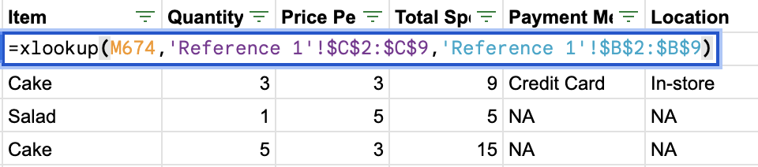

There is a challenge with `'Sandwich'` and `'Smoothie'` because both have the same price of `$4`, making it difficult to determine which record corresponds to which item. To address this, I chose to use the **frequency proportion** technique.

- **Task:** Identify the probability of `Sandwich` and `Smoothie`, then randomly assign the item name based on these probabilities.

- **Approach:**

**Calculate the probabilities:** Use `COUNTIF` to count how many transactions contain `Sandwich` and `Smoothie` in the dataset, then compute their respective probabilities.

  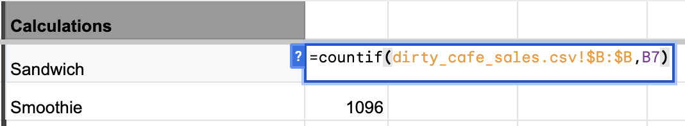
  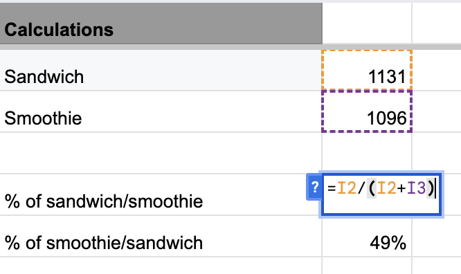

**Assign item names:** Use a conditional formula (`IF`) to filter items with a unit price of $4 and invalid item names, then assign the item name based on the calculated probabilities.

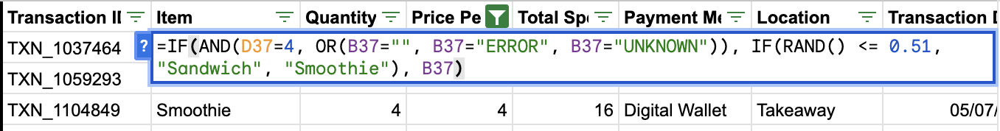

### **5.2. Handling Missing and Invalid `Total Sales` and `Quantity` Columns**

**Formula:** `Total Spent = Price per Unit × Quantity`

**Approach:**

* For the records where only one of the three values is missing or incorrect, the missing value can be easily calculated using the formula. For example, if `Total Spent` is missing, it can be computed by multiplying `Price per Unit` by `Quantity`.

* For records missing both the `Total Sales` and `Quantity` values, a different approach is applied by estimating the missing quantity using **imputation** based on the **average quantity per item**.

* Calculate the **average quantity** for each item per transaction using the `AVERAGE` function, nested with the `FILTER` function for each item.
* Add it as a new column in the price table for reference, ensuring to **filter only valid quantity numbers**.
* Use `VLOOKUP` to fill missing or invalid quantities.

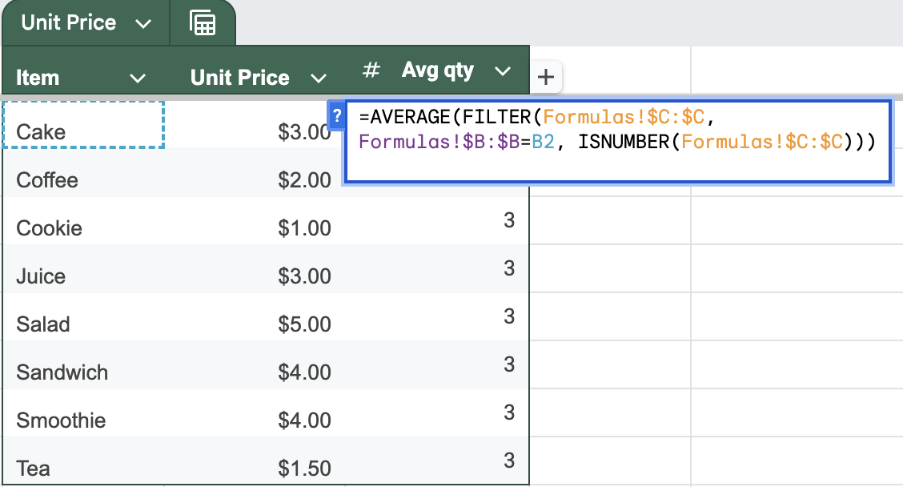

### **5.3. Dealing with Missing and Invalid `Date` column**

**Task:** Fill missing or invalid dates with plausible values based on nearby records.  
**Approach:** For any record that is not a valid date, replace it with the previous valid date using the `IF()` function nested with `ISNUMBER()` and `DATEVALUE()`.

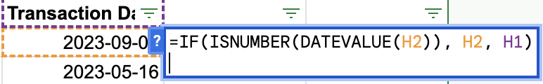

### **5.4. Dealing with Missing and Invalid `Payment Method` and `Location` Columns**

Approximately **30%** of the dataset had missing or invalid entries in the `Payment Method` column, and about **30%** in the `Location` column.

There are several approaches to handle missing categorical data:

* Impute with the most frequent value (mode).
* Use probabilities based on observed frequencies to fill in missing values.
* Build a predictive model to estimate missing values.

However, given the large proportion of missing values and the lack of sufficient information to make accurate guesses, I decided to fill these missing entries with `'NA'`. This approach allows for further investigation later and avoids introducing bias or incorrect data that could affect downstream modeling.

### **6. Correct Data Types**

Convert `Price per Unit` and `Total Spent` to currency ($) and `Transaction Date` to a date format.

## 7. **Final Dataset**

After cleaning:

* **Total Records:** 9,994 (from 10,000 original).

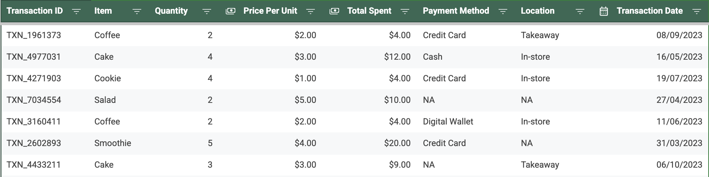

* **Actions taken:**

  * Corrected `Price`, `Quantity`, and `Total Spent`.
  * Assigned valid dates and corrected data types.
  * `Payment Method` and `Location` entries missing were set to `'NA'`.
  * 6 records removed due to severely missing values.

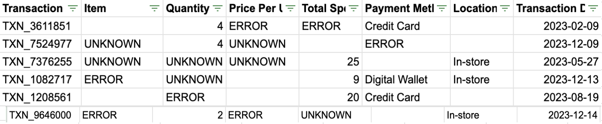

## 8. **Conclusion**

This project successfully addressed multiple data quality issues, including missing values, invalid entries, and inconsistencies. Through systematic cleaning and imputation, the dataset is now robust and ready for:

* Exploratory data analysis
* Predictive modeling
* Trend analysis
* Any advanced analytics tasks

With this cleaned dataset, reliable insights can now be drawn.
